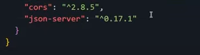

##Demo from this repository:
https://api-alura-geek-tau.vercel.app/


### How to use (resume)

1. Click "**Use this template**" or clone this repository.
2. Update or use the default [`db.json`](./db.json) in the repository.
3. Sign up or log in to [Vercel](https://vercel.com).
4. From the Vercel dashboard, click "**+ New Project**" and then "**Import**" your repository.
5. On the "**Configure Project**" screen, leave everything as default and click "**Deploy**".
6. Wait until deployment is complete, and your custom JSON server will be ready to serve!

## Default `db.json`

```json
{
  "products": [
    {
      "id": "ae84",
      "name": "Play",
      "price": "150",
      "image": "https://i.pinimg.com/originals/43/60/bc/4360bcc6293fa90c968bd65db3930266.jpg"
    },
    {
      "id": "921e",
      "name": "Sega",
      "price": "98",
      "image": "https://asset.conrad.com/media10/isa/160267/c1/-/en/1602624_RB_00_FB/image.jpg"
    },
    {
      "id": "c0e6",
      "name": "Nintendo",
      "price": "148",
      "image": "https://i5.walmartimages.com/asr/74eced06-e77a-44f8-b5bf-f93e3d9c69d2_1.1f619046c1c64fec1c03ee5848e56ced.jpeg"
    }
  ]
}


```

## Build It Yourself

If you'd like to create the project from scratch, you can follow this steps to make it

### Step 1

Create a new repository, for example, **alurageek-API**. Then clone that empty repository.

### Step 2

You need to run the npm init command:

```
npm init -y
```

This will generate a **package.json**. Now, what you need to do is change these lines:

Change this line:

```
 "main": "index.js",
```

To this:

```
  "main": "api/server.js",
```

And this:

```
"test": "echo \"Error: no test specified\" && exit 1"
```

To this:

```
"start": "node api/server.js"
```

### Step 3

Now it's time to run the command:

```
npm install json-server cors
```



You'll see that both **cors** and **_json-server_** have been added to the package.json.

### Step 4

Run the command:

```
npm install json-server
```

Add the **_.gitignore_** file and add **_node_modules_**.

### Step 5

Create a **_db.json_** file and add your own data.

Additionally, you'll need to add a new [Folder called **_api_**](./api/) and, inside it, this [**server.js**](./api/server.js) file:

```javascript
const jsonServer = require("json-server");
const server = jsonServer.create();
const router = jsonServer.router("db.json");
const middlewares = jsonServer.defaults();

server.use(middlewares);
// Add this before server.use(router)
server.use(
  jsonServer.rewriter({
    "/api/*": "/$1",
    "/product/:resource/:id/show": "/:resource/:id",
  })
);
server.use(router);
server.listen(3000, () => {
  console.log("JSON Server is running");
});

// Export the Server API
module.exports = server;
```

### Step 6

Create a new file named [**_vercel.json_**](./vercel.json)

```json
{
  "functions": {
    "api/server.js": {
      "memory": 1024,
      "includeFiles": "db.json"
    }
  },
  "rewrites": [
    {
      "source": "/(.*)",
      "destination": "api/server.js"
    }
  ]
}
```


